# Comparación de predicción de riesgo crediticio entre Modelos de Lenguaje y Machine Learning Clásico

**Tesista:** Lic. Federico Nicolás Moreno  
**Director:** Mgs. Boris Dorian Da Silva  
**Co-Director:** Dr. Cristian Bravo

---

## 1. Introducción

El crédito es el monto que una institución financiera presta a un consumidor con el compromiso de ser repagado con intereses en cuotas regulares. Prestar dinero implica clasificar bajo incertidumbre: al entregar el capital, la institución debe estimar qué tan probable es que el solicitante incumpla su compromiso de pago. Esto se denomina **riesgo crediticio**.

Para cuantificarlo, las instituciones construyen modelos predictivos que asignan a cada solicitud un puntaje numérico que refleja la probabilidad estimada de incumplimiento; con esa probabilidad se decide otorgar, rechazar o ajustar las condiciones del crédito. Conviene distinguir el **riesgo crediticio** como fenómeno económico —la posibilidad de que el deudor no pague— del **modelo de riesgo crediticio**, que es el artefacto estadístico o algorítmico que estima ese riesgo.

En la práctica, la información disponible al momento de la solicitud es incompleta. Parte proviene de lo que declara el cliente y parte de centrales de riesgo o burós de crédito, entidades que recopilan y centralizan historial de endeudamiento y comportamiento de pago de personas y empresas a partir de información reportada por múltiples instituciones financieras (Thomas et al., 2002). En América Latina operan burós internacionales como TransUnion y Equifax, junto con actores locales como Veraz, Nosis o DataCrédito. Todos ellos presuponen, en mayor o menor medida, que el cliente tiene historial crediticio previo.

En microfinanzas de mercados emergentes, donde el historial formal suele ser inexistente o fragmentado, los puntajes de buró pierden capacidad explicativa. En estos escenarios, desarrollar un modelo propio no es solamente una mejora técnica: aparece como una necesidad para atender a trabajadores independientes, hogares de menores ingresos y población no bancarizada. Además, los compromisos de pago en microfinanzas suelen ser más cortos —quincenales o mensuales— y los montos más bajos que en banca tradicional.

Esta tesis busca construir y evaluar un modelo de riesgo crediticio que, a partir de las variables disponibles al momento de la solicitud, clasifique cada crédito como probable de pago o probable de incumplimiento. La pregunta central es:

> **¿Puede un modelo de lenguaje de gran escala alcanzar o superar la performance de métodos clásicos de machine learning para credit scoring con datos tabulares, especialmente cuando el historial de buró es escaso?**

---

## 2. Marco teórico

El argumento de la tesis se apoya en tres bloques: la fortaleza del machine learning clásico para datos tabulares, la definición operativa de mora como variable objetivo, y la posibilidad de que los modelos de lenguaje extraigan información semántica que los modelos tabulares representan de forma limitada.

### 2.1 Machine learning clásico para datos tabulares

En datos tabulares, los métodos de *gradient boosting* dominan comparativos de clasificación, tanto en riesgo crediticio (Lessmann et al., 2015) como en dominios tabulares más amplios (Grinsztajn et al., 2022; Crook et al., 2007). El estándar práctico es **XGBoost** (Chen & Guestrin, 2016), y por eso se lo toma como baseline principal.

Lessmann et al. (2015) comparan 41 clasificadores sobre ocho datasets de *credit scoring* y muestran que los métodos de boosting tienen desempeño consistentemente fuerte. El trabajo también consolida las métricas estándar de evaluación: **ROC-AUC** como métrica primaria, complementada por **Gini** —definido como 2 × AUC − 1— y **KS**, que mide la máxima separación entre las distribuciones de puntajes de buenos y malos pagadores. En esta tesis, XGBoost representa el rival a vencer: si un LLM no supera o al menos no se acerca a ese baseline, su utilidad predictiva queda acotada.

### 2.2 Definición de mora y variable objetivo

Un crédito se clasifica como *default* si el deudor excede un umbral de días de atraso. La definición del umbral no es universal. El marco de Basilea II considera default cuando el banco estima improbable la recuperación total sin ejecutar garantías o cuando existe un atraso mayor a 90 días en una obligación material (BCBS, 2006). En fintechs y créditos al consumo, en cambio, umbrales de 60 y 90 días son frecuentes (Cornelli et al., 2022; Chioda et al., 2025). En microfinanzas, un atraso superior a 60 días equivale aproximadamente a dos cuotas mensuales impagas y captura un incumplimiento material sin esperar una ventana demasiado larga.

En este trabajo, la variable objetivo toma valor `target = 1` si el cliente incurrió en mora superior a 60 días, y `target = 0` si la mora fue de 30 días o menos. Los casos intermedios —31 a 60 días— se excluyen para evitar etiquetas ambiguas.

### 2.3 Modelos de lenguaje para datos tabulares

Los modelos clásicos de gradient boosting no operan sobre el significado de las variables. Si un solicitante declara que su negocio es “Peluquería y Manicuría” y su nivel educativo es “técnico”, XGBoost aprende asociaciones estadísticas entre etiquetas y pagos observados, pero no comprende qué implica una peluquería ni qué sugiere una formación técnica. Para el modelo, esos valores son categorías codificadas.

Los **modelos de lenguaje de gran escala** (*Large Language Models*, LLMs) ofrecen una alternativa. Durante el preentrenamiento, el modelo se expone a grandes volúmenes de texto y aprende representaciones internas del significado de palabras, contextos y relaciones. Luego, mediante postentrenamiento, se ajusta para seguir instrucciones y resolver tareas concretas (Ouyang et al., 2022). Esto permite que el modelo llegue a una tarea de crédito con conocimiento semántico previo: puede asociar rubros, actividades comerciales, niveles educativos o descripciones de negocio con rasgos económicos generales.

El antecedente directo en crédito es Feng et al. (2023), quienes evaluaron GPT-4, ChatGPT, LLaMA 1/2 y Bloomz sobre LendingClub. Encontraron que los LLMs propietarios alcanzaban AUC competitivo en *zero-shot*, aunque también exhibían sesgos demográficos. El aporte central para esta tesis es doble: muestran que el enfoque tiene potencial, pero también que los LLMs pueden trasladar sesgos o priors generales al proceso de scoring.

El puente metodológico entre una tabla y un LLM lo aporta **TabLLM** (Hegselmann et al., 2023). La idea es serializar cada fila como una oración en lenguaje natural: por ejemplo, una fila con edad 42, educación Master e ingreso 594 se transforma en “la persona tiene 42 años, su educación es Master, su ingreso es 594 dólares”. El LLM recibe esa narración más una instrucción de clasificación. En datasets pequeños y regímenes *few-shot*, TabLLM puede acercarse a modelos tabulares fuertes. Esta tesis adopta esa lógica para una cartera real de microfinanzas latinoamericanas.

---

## 3. Metodología

### 3.1 Diseño experimental

El diseño compara cuatro modelos: dos clásicos y dos variantes de un LLM open-source. El objetivo no es solo identificar quién gana en AUC, sino aislar de dónde viene la capacidad predictiva del LLM: del conocimiento preentrenado o de ejemplos de la cartera observados en contexto.

Del lado clásico se entrena **XGBoost** como baseline principal, por ser el estándar de la industria para datos tabulares. Se suma **Regresión Logística** como referencia interpretable, cercana a la lógica de una *scorecard* tradicional. Ambos modelos operan sobre variables numéricas y categóricas ya estructuradas.

Del lado de lenguaje se usa **Qwen3-8B**, un modelo open-source de 8B parámetros ejecutado localmente. Se aplica serialización TabLLM y se evalúan dos variantes: **zero-shot**, donde el modelo no recibe ejemplos resueltos, y **few-shot**, donde se le muestran 8, 16 o 32 casos balanceados del conjunto de entrenamiento antes de clasificar un nuevo crédito.

**Tabla 1. Modelos evaluados.**

| # | Modelo | Tipo | Rol en el comparativo |
|---:|---|---|---|
| 1 | Regresión Logística | Baseline clásico | Referencia interpretable / scorecard |
| 2 | XGBoost | ML clásico | Estándar fuerte para tabular |
| 3 | Qwen3-8B zero-shot | LLM open-source | Mide conocimiento previo sin ejemplos |
| 4 | Qwen3-8B few-shot | LLM con ejemplos | Mide adaptación in-context con 8–32 ejemplos |

### 3.2 Dataset

El dataset propietario contiene **5.351 créditos**, **94 variables numéricas/one-hot**, **4 variables de texto libre** y **4 variables meta** (`credito_id_anon`, `fecha_desembolso`, `target`, `set`). El período cubre julio de 2022 a enero de 2024, con split temporal train / validación / test.

**Tabla 2. Dataset utilizado.**

| Dataset | N créditos | Variables | Período | Split |
|---|---:|---|---|---|
| Fintech latinoamericana (propietario) | 5.351 | 94 num/one-hot + 4 texto + 4 meta | Jul 2022–Ene 2024 | Train 4.364 / Val 492 / Test 495 |

### 3.3 Métricas de evaluación

La métrica primaria es **ROC-AUC**, complementada con **Gini**, **KS** y **Brier score**. El AUC mide la capacidad de ordenar correctamente buenos y malos pagadores; Gini reescala el AUC; KS mide la separación máxima entre distribuciones de puntajes; y Brier score evalúa error cuadrático sobre probabilidades. Para modelos tabulares, la calibración posterior puede ser necesaria porque un modelo puede discriminar bien y aun así emitir probabilidades mal calibradas (Niculescu-Mizil & Caruana, 2005; Zadrozny & Elkan, 2002).

La comparación por segmento se vuelve central porque la hipótesis del trabajo no es que el LLM deba superar globalmente a XGBoost, sino que puede aportar donde el buró formal es escaso y el texto del negocio gana peso relativo.

\newpage

## 3.4 Análisis exploratorio de datos integrado

El EDA no se planteó como un inventario de variables, sino como una instancia metodológica previa al modelado. Antes de entrenar, la pregunta era doble: **dónde está la señal de riesgo** y **qué sesgos del portfolio podrían confundir a un modelo ingenuo**. Por eso el análisis conecta cada hallazgo con una decisión experimental: cómo partir temporalmente los datos, cómo tratar la ausencia de información, qué modelo debería dominar el promedio y en qué segmento podría aparecer una ventaja relativa del enfoque LLM.

El análisis es reproducible desde este repositorio: el linaje exploratorio está en `lineage/eda_lineage.py`, las figuras finales están en `figures/` y la segmentación usada para los resultados finales se define en `scripts/05_segmentacion_thin_file.py`.

### 3.4.1 De qué datos hablamos y cómo se define el target

El dataset contiene **5.351 créditos** otorgados por una *fintech* latinoamericana de micropréstamos entre julio de 2022 y enero de 2024. Cada fila representa un crédito ya desembolsado, no una solicitud cualquiera. Esto es clave: la base observada es el **portfolio aprobado** por la entidad, por lo que las relaciones entre variables no reflejan a toda la población solicitante, sino a una población previamente filtrada por reglas y decisiones de originación.

Las variables provienen de tres fuentes. El **formulario de solicitud** aporta edad, ingresos, gastos, antigüedad del negocio, destino del préstamo, educación y texto libre. De allí salen las cuatro variables que habilitan el enfoque semántico: `subcategoria_texto`, `descripcion_negocio`, `otra_categoria_negocio` y `tipo_credito`. El **buró TransUnion** aporta 20 variables CreditVision sobre mora, saldos, antigüedad, consultas y diversificación crediticia. Finalmente, los **registros internos** describen antigüedad como cliente, canal de adquisición y alianza comercial (`CANAL_xx`, `ALIANZA_xx`).

La variable objetivo se construye de forma binaria: `target = 1` cuando el crédito supera 60 días de mora y `target = 0` cuando la mora máxima observada es de 30 días o menos. Los casos intermedios, entre 31 y 60 días, se excluyen para evitar etiquetas ambiguas. El resultado es un target naturalmente balanceado: **2.606 defaults (48,7%)** y **2.745 no-defaults (51,3%)**. No se aplicó *oversampling*, SMOTE ni rebalanceo artificial.

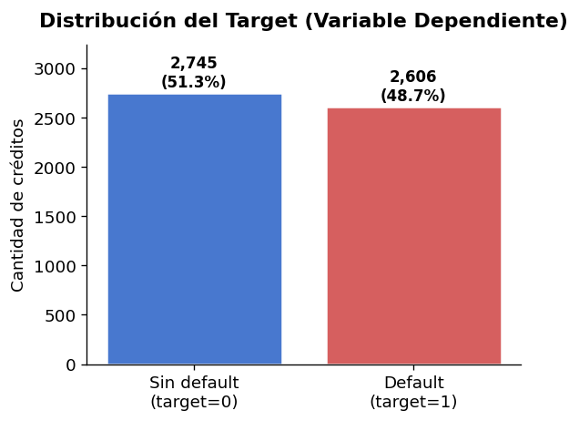{width=3.8in}

### 3.4.2 Tiempo, split temporal y maduración de mora

La separación entre entrenamiento, validación y test respeta la cronología: **train = 4.364**, **validación = 492** y **test = 495**. Esta decisión no es solo una preferencia metodológica; en crédito, evaluar con datos mezclados temporalmente puede crear un optimismo artificial. En producción, un modelo se entrena con historia disponible hasta cierto momento y predice créditos futuros. Por eso un *k-fold* barajado, aunque sea estratificado, permite que información de cohortes futuras influya indirectamente en la evaluación de cohortes pasadas.

El segundo punto temporal es el ***vintage maturation bias***. Las cohortes viejas tuvieron más meses para revelar mora tardía; las recientes, en cambio, pueden parecer mejores simplemente porque todavía no tuvieron tiempo suficiente para cruzar el umbral de 60 días. La tasa mensual de default, por lo tanto, no puede leerse como *concept drift* sin considerar cuánta maduración tuvo cada cohorte.

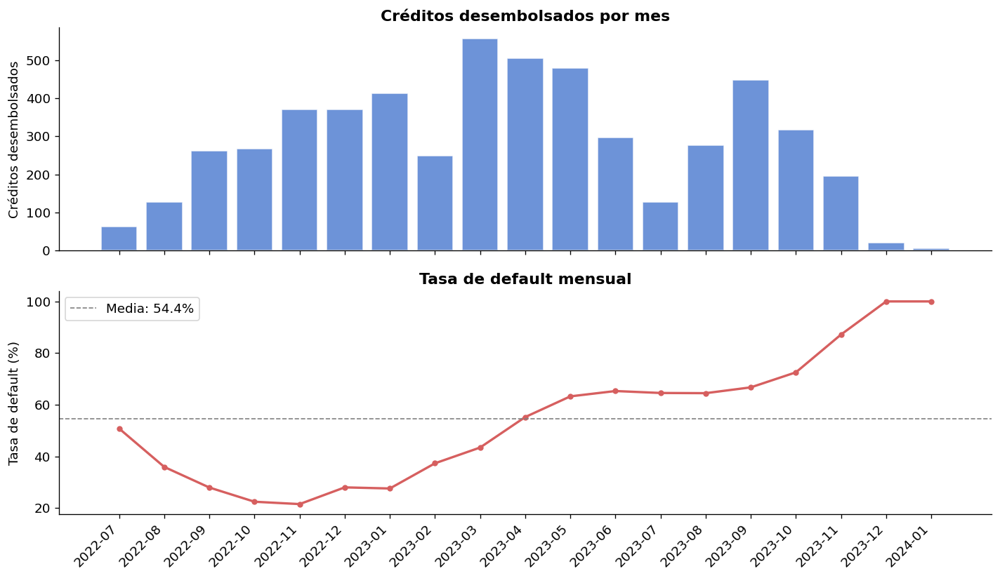{width=4.6in}

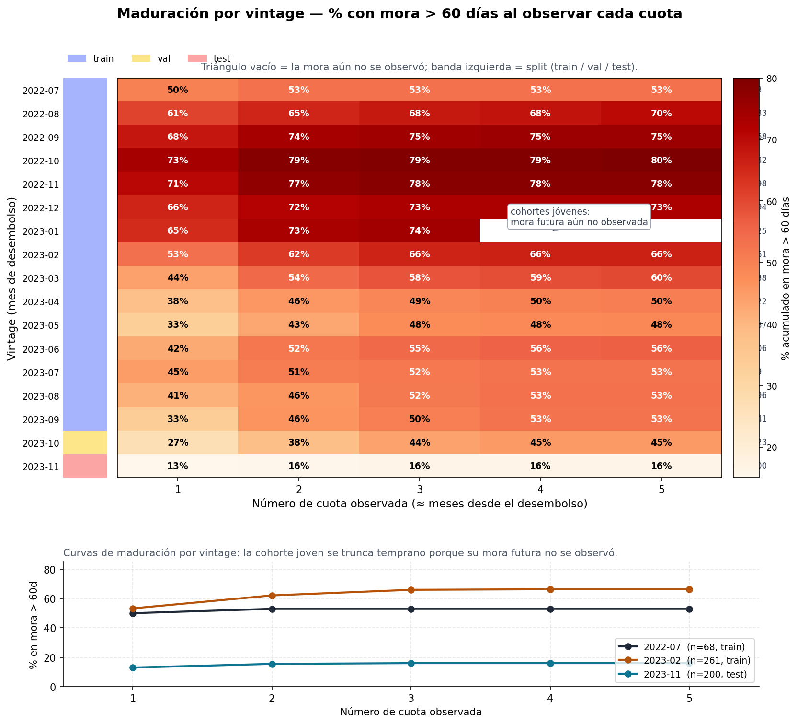{width=4.65in}

La Figura 3 muestra el problema de manera directa. Dentro de una misma cohorte, la proporción acumulada de defaults crece con las cuotas observadas. Entre cohortes, las más antiguas suelen mostrar más mora porque fueron observadas durante más tiempo. En consecuencia, la validación honesta debe respetar el orden temporal. Esta lógica explica también por qué los modelos clásicos por segmento se evaluaron con `TimeSeriesSplit` y no con validación aleatoria.

### 3.4.3 Missing informativo y códigos del buró

Los faltantes convencionales aparecen sobre todo en variables del formulario: `otra_categoria_negocio`, `shops_rent_amount`, `estimated_income`, `shops_daily_incomes`, `cost_ingress_ratio` y `score_debets`, entre otras. La ausencia no se comporta como ruido aleatorio. En varias variables, el grupo sin dato tiene una tasa de default muy diferente del grupo con dato; por ejemplo, en `shops_daily_incomes` y `estimated_income` la diferencia ronda **28,5 puntos porcentuales** a favor del grupo sin dato.

Esto sugiere que el *missing* puede describir un tipo de cliente o negocio, no solo una falla de carga. Un comercio que no declara alquiler, por ejemplo, puede estar indicando local propio o una estructura menos formal, y ambas posibilidades tienen señal de riesgo. Por eso la decisión de modelado no es imputar a ciegas: se preserva la ausencia mediante indicadores explícitos.

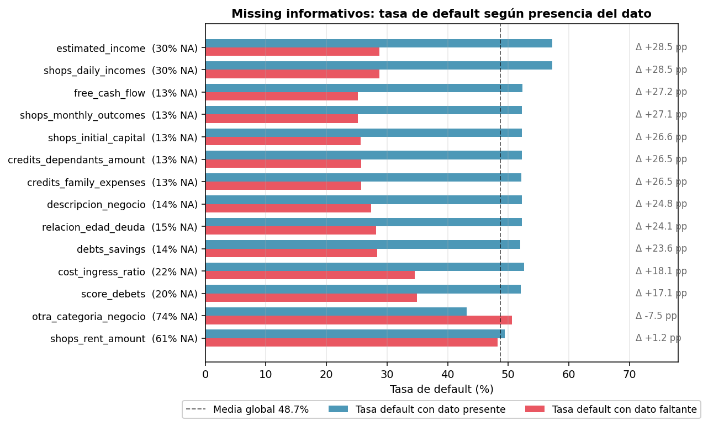{width=4.35in}

Los códigos negativos de TransUnion requieren una aclaración separada. Valores como `-1`, `-2` o `-3` **no son nulos convencionales**: codifican ausencia de obligaciones, eventos o historial reportable en el buró. En muchos casos son señal protectora. Por ejemplo, `aepmag01` muestra una tasa de default cercana a 0,389 cuando el código es negativo y cercana a 0,770 cuando existe un valor no negativo. En `agg2503`, `tranbal09` y `utlmag04` ocurre algo similar: no tener ciertas obligaciones registradas puede ser mejor que tenerlas.

Esta distinción es importante para todos los modelos. XGBoost puede aprender estos códigos como valores informativos; la Regresión Logística necesita estandarización e indicadores bien definidos; y el LLM no debería recibir simplemente “-1”, sino una traducción semántica del tipo “sin obligación registrada” o “sin evento de mora reportado”.

### 3.4.4 Outliers: heterogeneidad real, no errores

Las variables financieras declaradas tienen colas largas. Al aplicar un corte IQR con factor 3 sobre escala logarítmica, se detectan outliers en **6,8%** del monto solicitado, **5,4%** de gastos familiares y **0,6%** de ingresos mensuales del negocio. Estos valores no se tratan automáticamente como errores: reflejan la heterogeneidad del segmento microempresarial, donde conviven negocios pequeños con otros de escala atípica.

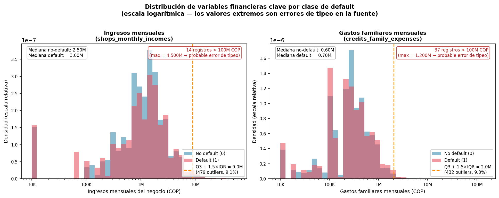{width=4.35in}

La decisión de modelado depende del algoritmo. XGBoost es relativamente robusto porque particiona el espacio mediante cortes y no requiere linealidad. La Regresión Logística es más sensible a colas largas, por lo que la winsorización o transformaciones logarítmicas son más relevantes. En el caso del LLM, la serialización debe evitar precisión falsa: es preferible escribir montos redondeados y comprensibles antes que números extensos con decimales irrelevantes.

### 3.4.5 Predictores: predominan buró e internos

La correlación *point-biserial* confirma que la señal más fuerte no proviene del autorreporte simple, sino del buró y de variables internas de originación. Entre las variables más asociadas al target aparecen `g051s` (r = -0,482), `wd81` (r = -0,375), `antiguedad_cliente` (r = -0,351), `wd03` (r = -0,340), `ALIANZA_05` (r = +0,337), `aepmag01` (r = +0,331), `duemag01` (r = +0,312), `at103s` (r = +0,295) y `CANAL_07` (r = +0,264).

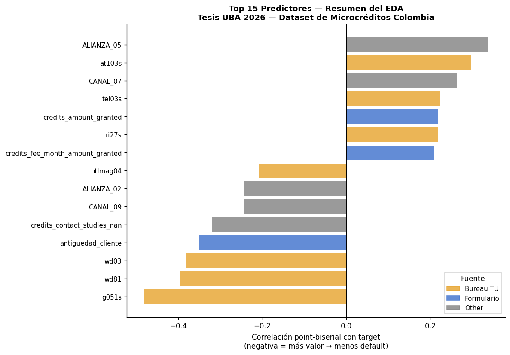{width=4.9in}

El análisis categórico llega a la misma conclusión. El *Information Value* de `ALIANZA_xx` y `CANAL_xx` ronda 0,56, por encima de la educación del cliente y de `subcategoria_texto`. Es decir, **quién trajo al cliente** y **por qué circuito ingresó** puede ser tan informativo como varios atributos declarados por el propio solicitante. Este hallazgo anticipa que XGBoost debería ser un baseline fuerte: la señal principal es tabular, estructurada y local al portfolio.

### 3.4.6 El sesgo de selección invertido en `wd81`

El hallazgo más importante del EDA está en `wd81`, la peor mora histórica. En el universo general, la regla esperada es simple: a mayor mora pasada, mayor riesgo futuro. En esta cartera aprobada ocurre lo contrario. `wd81` correlaciona negativamente con el default (r = -0,375): los clientes con **0 días de mora histórica** muestran una tasa de default cercana a **87,7%**, mientras que los clientes con peor mora histórica superior a 120 días muestran alrededor de **6,1%**.

{width=4.9in}

La explicación no es que la mora histórica deje de importar, sino que se observa un portfolio ya filtrado. Un cliente con historial grave probablemente recibió crédito solo si compensaba con otras señales fuertes: mayor antigüedad, monto menor, ingresos más verificables o una relación previa más sólida. En cambio, clientes sin mora previa pueden haber entrado con menos información o mayor incertidumbre. Este patrón es central para la tesis porque anticipa un modo de falla del LLM *zero-shot*: si aplica la heurística general “mora alta implica riesgo alto”, puede equivocarse precisamente donde el modelo tabular aprende la relación local invertida.

### 3.4.7 Headroom semántico del texto de negocio

Aunque el buró domina el agregado, el texto del negocio contiene señal propia. `subcategoria_texto` está presente en el 100% de los casos, tiene 38 valores posibles y 34 categorías con tamaño suficiente. Entre la subcategoría más segura y la más riesgosa aparece un rango de **54,6 puntos porcentuales** de default. Ese margen es el ***headroom* semántico**: información de riesgo contenida en el significado del rubro.

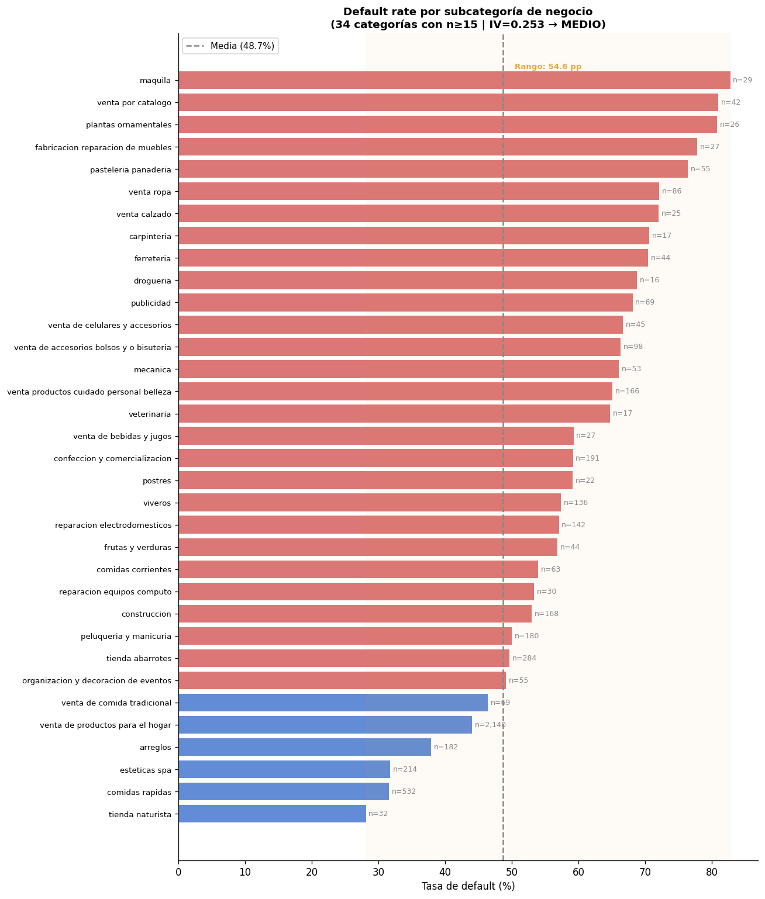{width=3.85in}

Para XGBoost, rubros como “confección”, “venta de ropa para mujer” o “bordados personalizados” son etiquetas distintas, usualmente representadas por columnas *one-hot*. Para un LLM, en cambio, esos textos pertenecen a un universo económico similar. La hipótesis no es que el texto reemplace al buró, sino que puede aportar cuando la señal formal es escasa.

### 3.4.8 Clientes con buró esparso y decisiones experimentales

En esta tesis prefiero hablar de **clientes con buró esparso**. La idea es simple: son casos donde la fintech tiene menos señales formales del buró para estimar riesgo. No significa que el cliente esté “sin datos” ni que sea automáticamente más riesgoso; significa que, para ese crédito, TransUnion aporta menos profundidad histórica. Por eso este grupo es importante para la comparación con LLMs: cuando el buró dice menos, el texto del negocio y el contexto del caso pueden ganar más peso.

Para definirlo de manera consistente con los scripts de resultados, cuento cuántas variables de TransUnion tienen valor `-1`, que indica ausencia de un registro específico. Formalmente, `n_tu_missing = (TU_VARS == -1).sum(axis=1)`, y clasifico como **buró esparso** todo caso con `n_tu_missing >= 6`. Esta corrección evita confundir la exploración general de códigos negativos (`-1`, `-2`, `-3`) con la segmentación experimental usada para comparar modelos.

Con esa regla, hay **1.911 créditos esparsos (35,7%)** y **3.440 densos (64,3%)**. En test, el esparso queda reducido a **28 casos**, frente a **467 densos**, porque las cohortes recientes tienen buró más completo.

| Partición | Denso | Esparso | Total |
|---|---:|---:|---:|
| Train | 2.515 | 1.849 | 4.364 |
| Validación | 458 | 34 | 492 |
| Test | 467 | 28 | 495 |
| **Total** | **3.440** | **1.911** | **5.351** |

En síntesis, el EDA deja una expectativa clara. **XGBoost debería dominar el agregado y el segmento denso**, porque allí el buró y las variables internas concentran la señal. **El LLM no debería ganar por conocimiento general**, especialmente por el sesgo invertido de `wd81`. Su oportunidad, si existe, está en el segmento de buró esparso, donde la información formal del buró disminuye y el texto de negocio puede ganar peso relativo.

| Hallazgo del EDA | Decisión de modelado |
|---|---|
| Target balanceado 48,7% / 51,3% | Usar AUC-ROC sin rebalanceo artificial. |
| Estructura temporal y maduración desigual | Split temporal y `TimeSeriesSplit`; evitar k-fold barajado. |
| Missing informativo | Imputar con indicadores de ausencia. |
| Códigos TU `-1` semánticos | Preservar en XGBoost y traducir a texto para el LLM. |
| Buró e internos dominan predictores | Tomar XGBoost como baseline fuerte. |
| `wd81` invierte la intuición general | Esperar falla del LLM *zero-shot* por priors equivocados. |
| Subcategoría con headroom semántico | Probar TabLLM y *few-shot*. |
| Test esparso de n = 28 | Reportar hallazgos en buró esparso como prometedores, no concluyentes. |

La pregunta que el comparativo de modelos debe responder queda, entonces, acotada: **no se trata solo de si Qwen3-8B supera a XGBoost en promedio, sino de si agrega señal útil donde el buró formal es escaso**.

\newpage

## 4. Evaluación de modelos y resultados

La evaluación compara los modelos en dos niveles. Primero, se reporta el desempeño global sobre el **test temporal honesto** —la partición más reciente de la cartera, n = 495—, porque es la aproximación más cercana al uso en producción. Segundo, se desagrega por densidad de buró —segmento de buró esparso y segmento denso—, porque la hipótesis de la tesis no es que el LLM supere a XGBoost en promedio, sino que pueda aportar señal donde la información formal del buró es escasa.

### 4.1 Modelos evaluados y protocolo

La comparación final incluye cuatro familias: Regresión Logística, XGBoost, Qwen3-8B TabLLM *zero-shot* y Qwen3-8B TabLLM *few-shot*. La Regresión Logística funciona como referencia lineal e interpretable. XGBoost es el baseline principal por su dominio en datos tabulares. El LLM *zero-shot* mide cuánto puede resolver el modelo desde su conocimiento preentrenado y la serialización de la fila. El LLM *few-shot* mide si unos pocos ejemplos resueltos del conjunto de entrenamiento permiten corregir sus priors hacia la distribución real de la cartera.

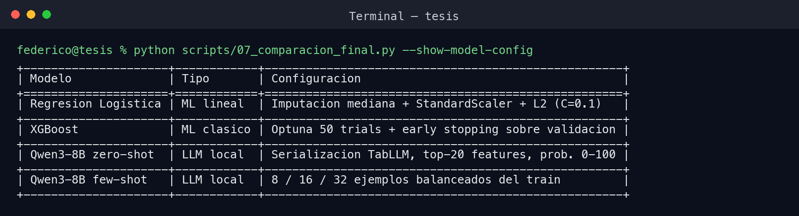{width=5.7in}

La métrica primaria es **AUC-ROC**. Intuitivamente, el AUC mide la probabilidad de que, tomando un crédito que efectivamente cayó en default y otro que no, el modelo asigne mayor riesgo al primero. Un AUC de 0,50 equivale a azar; 1,0 equivale a discriminación perfecta. Se reportan además **Gini** (2 × AUC − 1), **KS** y **Brier score**. La evaluación del LLM se hace sobre el test, porque no se reentrena por fold; para los modelos clásicos, el total se reporta en test temporal y el desglose por segmento se complementa con validación cruzada temporal.

### 4.2 Corrección metodológica: el costo del leakage temporal

Un hallazgo metodológico importante es que el protocolo anterior inflaba las métricas. La validación cruzada estratificada con barajado (`StratifiedKFold(shuffle=True)`) mezcla créditos de distintos meses y permite que el entrenamiento use información del futuro para predecir el pasado. En un problema con estructura temporal y maduración desigual de mora, eso introduce *data leakage*.

La corrección fue reemplazar ese procedimiento por **`TimeSeriesSplit` con 5 splits**, ordenando por fecha de desembolso. Cada fold entrena sobre meses anteriores y valida sobre el bloque temporal siguiente. La diferencia no es menor: el k-fold barajado inflaba el AUC entre **0,10 y 0,21 puntos**, una magnitud enorme en credit scoring.

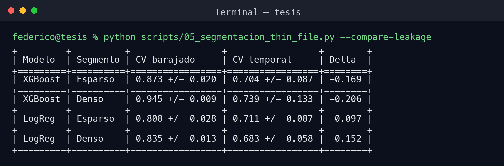{width=5.9in}

El caso más claro es XGBoost en segmento denso: el CV barajado sugería un AUC de 0,945, casi perfecto, pero ese número no sobrevive cuando se respeta el orden temporal. La corrección no solo baja el promedio; también aumenta la variabilidad entre folds, revelando que distintas cohortes tienen comportamientos de pago distintos.

### 4.3 Desempeño global en test temporal

Sobre el conjunto de test honesto, **XGBoost es el mejor modelo global**. Alcanza un AUC de **0,820**, Gini de 0,640 y KS de 0,531. La Regresión Logística queda bastante por detrás, con AUC de 0,705. Los dos modelos LLM quedan cerca del azar a nivel agregado: Qwen3 *zero-shot* obtiene AUC de 0,529 y Qwen3 *few-shot* 16 ejemplos obtiene AUC de 0,527.

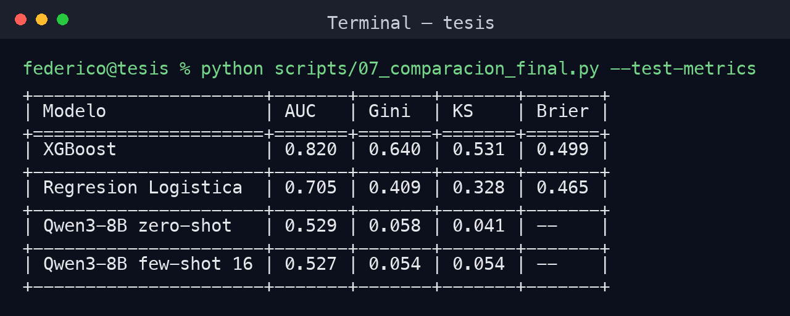{width=5.8in}

La lectura principal es que el conocimiento semántico preentrenado no alcanza para superar a un modelo tabular entrenado sobre la cartera. XGBoost aprende directamente la estructura estadística del portfolio aprobado, incluidas relaciones contraintuitivas como la inversión de `wd81`. El LLM, en cambio, necesita ejemplos del dominio para corregir esos priors; sin ellos, interpreta la cartera desde reglas generales que no siempre aplican.

### 4.4 Por qué falla el zero-shot

El resultado del LLM *zero-shot* no es simplemente bajo: es explicable desde el EDA. El modelo aplica una regla general razonable —“mora histórica alta implica mayor riesgo”—, pero en esta cartera aprobada esa relación está invertida por sesgo de selección. Por eso obtiene AUC global de 0,529 y, en el segmento esparso del test, AUC de **0,460**, por debajo del azar.

Este resultado es relevante porque documenta un modo de falla específico de los LLMs en *credit scoring*: cuando se aplican sobre portfolios ya filtrados por decisiones previas de aprobación, el conocimiento general del mundo puede jugar en contra. El modelo no falla porque no “entienda” qué es la mora; falla porque entiende una regla válida para una población general, pero no para esta cartera condicionada por aprobación.

### 4.5 Few-shot: la señal aparece cuando el buró es esparso

El experimento *few-shot* muestra al LLM ejemplos resueltos extraídos exclusivamente del entrenamiento, balanceados entre default y no-default, antes de pedirle que clasifique un caso de test. Se probaron 8, 16 y 32 ejemplos. El objetivo es que el modelo observe casos reales de la cartera y ajuste su lectura de las correlaciones invertidas.

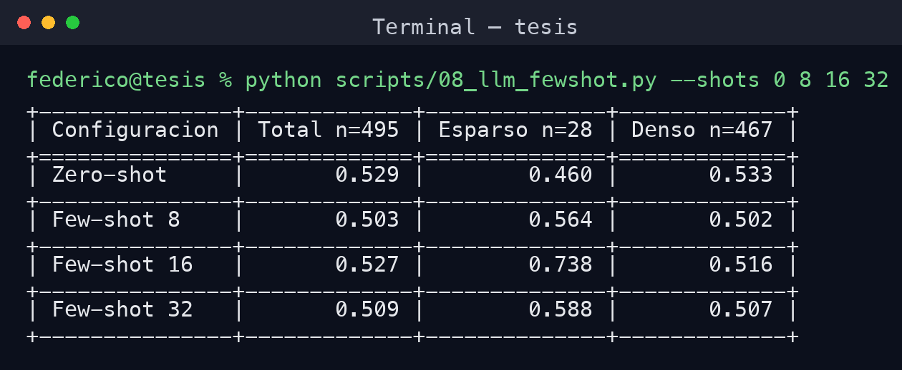{width=5.8in}

El resultado central aparece en el segmento de buró esparso: con **16 ejemplos**, Qwen3 alcanza **AUC = 0,738** en el segmento esparso, frente a **0,460** en *zero-shot*. La mejora es de +0,278 puntos de AUC. En el segmento denso, en cambio, el LLM permanece cerca del azar. Esto coincide con la hipótesis del EDA: donde el buró formal aporta menos señal, el texto del negocio y la adaptación contextual tienen más espacio para aportar.

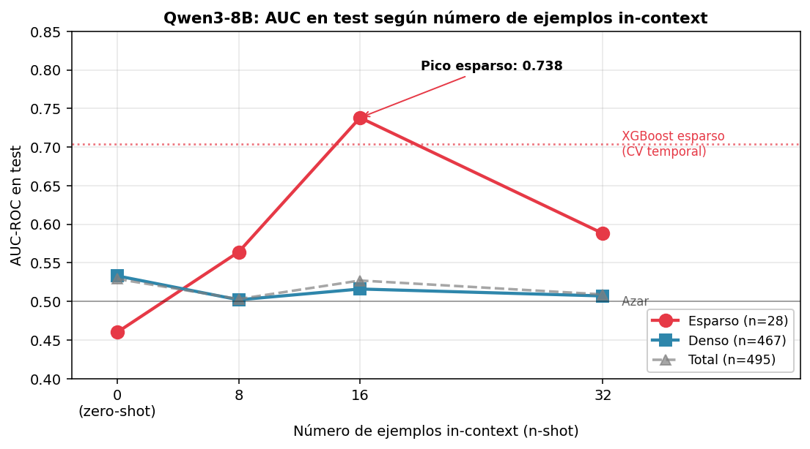{width=4.9in}

La evidencia debe leerse con cautela por tres motivos. Primero, el test esparso tiene solo **28 casos**, por lo que el intervalo de incertidumbre es amplio. Segundo, la relación no es monótona: 32 ejemplos rinde peor que 16, posiblemente por saturación del prompt o por incorporación de ejemplos menos informativos. Tercero, la mejora no aparece en el agregado ni en el segmento denso; es una señal localizada, no una superioridad general del LLM.

### 4.6 Comparación final por segmento

La comparación por segmento sintetiza el hallazgo. XGBoost domina globalmente y especialmente donde el buró es denso. El LLM *few-shot* solo se vuelve competitivo en el segmento esparso, justamente donde la hipótesis esperaba que la señal semántica pudiera ganar peso relativo.

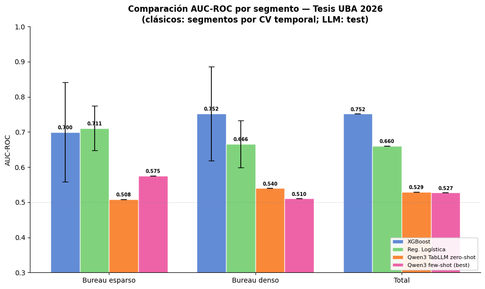{width=5.2in}

El detalle numérico refuerza esa lectura:

- **Buró esparso**: XGBoost alcanza 0,704 ± 0,087 en CV temporal; Regresión Logística, 0,711 ± 0,087; Qwen3 *zero-shot*, 0,460 en test; y Qwen3 *few-shot* 16, **0,738** en test.
- **Denso**: XGBoost llega a **0,739 ± 0,133**; Regresión Logística, 0,683 ± 0,058; Qwen3 *zero-shot*, 0,533; y Qwen3 *few-shot* 16, 0,516.
- **Total test temporal**: XGBoost obtiene **0,820**, Regresión Logística 0,705, Qwen3 *zero-shot* 0,529 y Qwen3 *few-shot* 16 0,527.

Esta comparación mezcla dos fuentes de evaluación por una razón metodológica: los modelos clásicos por segmento se reportan con CV temporal, mientras que los LLM se reportan en test porque la inferencia no se reejecutó por fold. Por eso la comparación es orientativa y debe leerse junto con las salvedades de muestra. Aun así, la dirección del resultado es consistente con la teoría: **el LLM no compite como clasificador general, pero muestra una señal prometedora en el subgrupo donde el buró es escaso**.

### 4.7 Discusión

La primera conclusión es que **XGBoost gana por estructura estadística**. El modelo tabular aprende directamente la distribución de la cartera aprobada, incluidos patrones contraintuitivos generados por sesgo de selección. No necesita comprender semánticamente las variables: le alcanza con observar suficientes ejemplos y capturar interacciones.

La segunda conclusión es que el **LLM zero-shot no es confiable para esta cartera**. Su conocimiento general sobre crédito puede ser correcto en promedio, pero equivocado para un portfolio ya filtrado por aprobación. Esto confirma que usar LLMs como clasificadores financieros sin datos del dominio puede producir predicciones plausibles pero mal orientadas.

La tercera conclusión es la más interesante para la tesis: **el few-shot abre una oportunidad localizada en clientes con buró esparso**. Con 16 ejemplos, el LLM aprende parte de la estructura local y mejora de forma importante en el segmento esparso. La evidencia todavía no alcanza para afirmar superioridad robusta por el n pequeño, pero sí justifica continuar con validación externa, bootstrap o fine-tuning.

### 4.8 Conclusión de la evaluación

La respuesta a la pregunta de investigación es matizada. **A nivel global, Qwen3-8B no iguala ni supera a XGBoost**: el AUC de 0,820 del modelo tabular queda muy por encima del LLM. Sin embargo, **en el segmento con buró esparso aparece una señal favorable al LLM few-shot**, con AUC de 0,738 sobre 28 casos de test. La hipótesis queda parcialmente respaldada: el aporte semántico del LLM no reemplaza al modelo tabular, pero puede ser útil donde el buró formal es escaso y el texto del negocio contiene información de riesgo.

---

## Referencias citadas

- Basel Committee on Banking Supervision [BCBS]. (2006). *International Convergence of Capital Measurement and Capital Standards: A Revised Framework*. Bank for International Settlements.
- Chen, T., & Guestrin, C. (2016). XGBoost: A scalable tree boosting system. *KDD 2016*.
- Chioda, L., Gertler, P., Higgins, S., & Medina, A. (2025). *FinTech lending to borrowers with no credit history*.
- Cornelli, G., Frost, J., Gambacorta, L., & Jagtiani, J. (2022). The impact of fintech lending on credit access. BIS Working Papers No. 1041.
- Crook, J. N., Edelman, D. B., & Thomas, L. C. (2007). Recent developments in consumer credit risk assessment. *European Journal of Operational Research*.
- Feng, S., et al. (2023). Empowering many, biasing a few: Generalist credit scoring through large language models. arXiv:2310.00566.
- Grinsztajn, L., Oyallon, E., & Varoquaux, G. (2022). Why do tree-based models still outperform deep learning on tabular data? *NeurIPS 2022*.
- Hegselmann, S., et al. (2023). TabLLM: Few-shot classification of tabular data with large language models. *AISTATS 2023*.
- Lessmann, S., Baesens, B., Seow, H.-V., & Thomas, L. C. (2015). Benchmarking state-of-the-art classification algorithms for credit scoring. *European Journal of Operational Research*, 247(1), 124–136.
- Siddiqi, N. (2017). *Intelligent Credit Scoring: Building and Implementing Better Credit Risk Scorecards*. Wiley.
- Niculescu-Mizil, A., & Caruana, R. (2005). Predicting good probabilities with supervised learning. *ICML 2005*.
- Ouyang, L., et al. (2022). Training language models to follow instructions with human feedback. *NeurIPS 2022*.
- Thomas, L. C., Edelman, D. B., & Crook, J. N. (2002). *Credit Scoring and Its Applications*. SIAM.
- Zadrozny, B., & Elkan, C. (2002). Transforming classifier scores into accurate probability estimates. *KDD 2002*.
